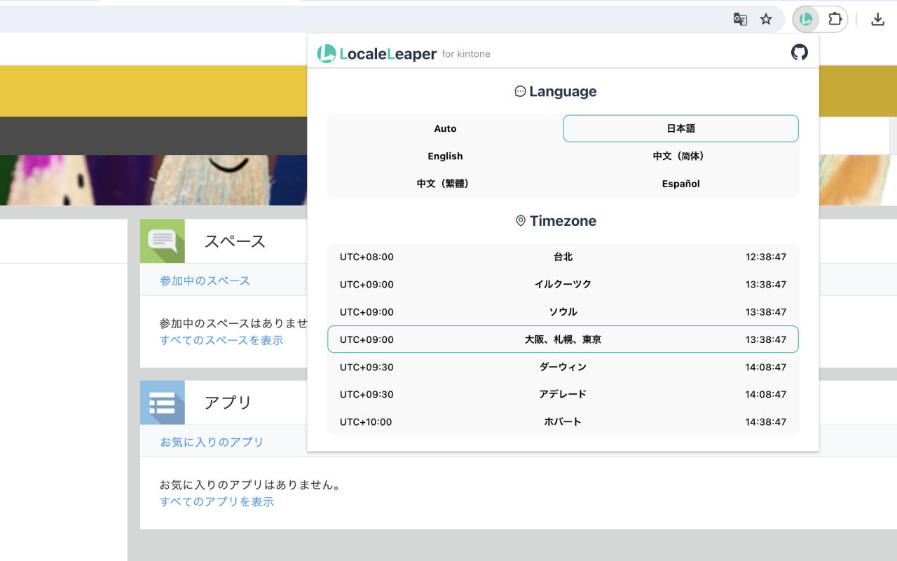

  <a href="https://chromewebstore.google.com/detail/adpfpbogonofdljjmipfpheknmadjdck" target="_blank" rel="noopener noreferrer">
    <picture>
        <source media="(prefers-color-scheme: dark)" srcset="icons/locale-leaper-banner-dark.svg" width="512">
        <source media="(prefers-color-scheme: light)" srcset="icons/locale-leaper-banner.svg" width="512">
        
    </picture>
  </a>

  <!-- https://developer.chrome.com/docs/webstore/branding?hl=ja -->
  

[English](./README.md) | 日本語

## 概要

> "LocaleLeaper"という名前は、「ロケール（地域や言語設定）を跳び越える者」を意味します。  
> これは、ユーザーが簡単に異なる地域設定や言語設定に切り替えることができる、という機能を象徴しています。
>
> \- GPT-4

LocaleLeaperは、[kintone](https://kintone.cybozu.co.jp/)の表示言語・タイムゾーンを素早く変更するためのブラウザ拡張機能です。

異なる言語・タイムゾーンのメンバーと仕事をする場合や、kintoneプラグインの動作確認などで効果を発揮します。

## インストール

[chrome ウェブストア](https://chromewebstore.google.com/detail/adpfpbogonofdljjmipfpheknmadjdck)からインストールしてください。

または、[Releases (英語)](https://github.com/tasshi-me/locale-leaper/releases)からZIPファイルをダウンロードしてください。

## 使い方

拡張機能のアイコンをクリックすると、パネルが表示されます。
パネルから設定したい言語・タイムゾーンを選択してください。

<picture>
    <source media="(prefers-color-scheme: dark)" srcset="icons/store-screenshot_ja_dark.png" width="800">
    <source media="(prefers-color-scheme: light)" srcset="icons/store-screenshot_ja_light.png" width="800">
    
</picture>

## ライセンス

このプロジェクトのライセンスは [MITライセンス](./LICENSE) です。

## 免責事項

この OSS は、私個人の著作物であり、サイボウズ株式会社、その他、私の所属する組織とは一切関係ありません。
