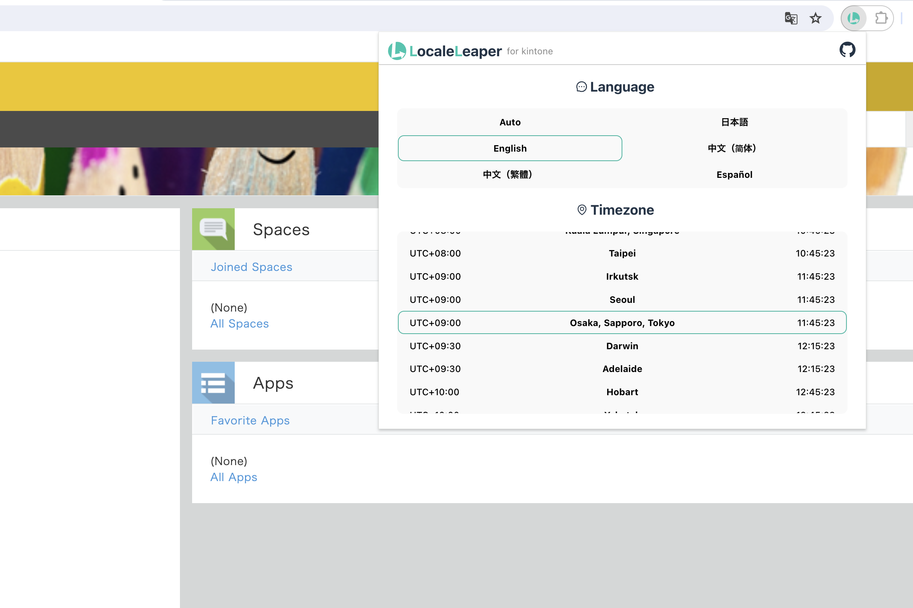

  <a href="https://chromewebstore.google.com/detail/cofjdblceejmaggjlbjhbdepgmnegiek" target="_blank" rel="noopener noreferrer">
    <picture>
        <source media="(prefers-color-scheme: dark)" srcset="icons/locale-leaper-banner-dark.svg" width="512">
        <source media="(prefers-color-scheme: light)" srcset="icons/locale-leaper-banner.svg" width="512">
        
    </picture>
  </a>

  <!-- https://developer.chrome.com/docs/webstore/branding?hl=ja -->
  

English | [日本語](./README.ja.md)

## Overview

> Leap the languages and time zones!

With the LocaleLeaper, you can quickly switch the language and timezone of [kintone](https://www.kintone.com/en-us/).

This browser extension is perfect for working with different languages/timezone members or testing the kintone plugin/customization.

## Installation

Install from the [Chrome Web Store](https://chromewebstore.google.com/detail/cofjdblceejmaggjlbjhbdepgmnegiek).

or download a zip file from the [Releases](https://github.com/tasshi-me/locale-leaper/releases).

## Usage

Click the extension icon, and choose the language/timezone to set.

<picture>
    <source media="(prefers-color-scheme: dark)" srcset="icons/store-screenshot_en_dark.png" width="800">
    <source media="(prefers-color-scheme: light)" srcset="icons/store-screenshot_en_light.png" width="800">
    
</picture>

## License

This project is licensed under the [MIT license](./LICENSE).

## Disclaimer

This OSS is my own personal work and does not have any relationship with Cybozu Inc. or any other organization to which I belong.
