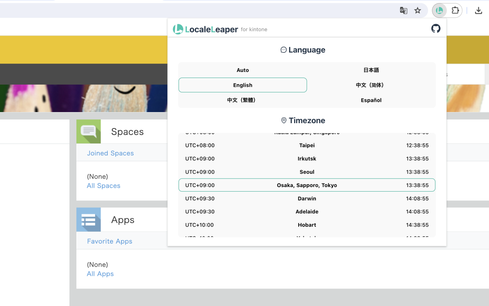

## Store information

### Description

With the LocaleLeaper, you can quickly switch the language and timezone of kintone.

Perfect for working with different languages/timezone members or testing the kintone plugin/customization.

For more details: https://github.com/tasshi-me/locale-leaper#readme

This OSS is my own personal work and does not have any relationship with Cybozu Inc. or any other organization to which I belong.

### Category

Communication

### Language

English

### Shop icon

### Screen shot

### Promo tile

### Homepage URL

https://github.com/tasshi-me/locale-leaper#readme

### Support URL

https://github.com/tasshi-me/locale-leaper/issues

## Policy

### Single use

This extension is only for updating the language and timezone settings of kintone.
In the normal way, we need to seek nested config to change lang/timezone.
This extension reduces that process.

### Why permissions are needed

#### activeTab

activeTab is required because this extension retrieves/updates values of the currently active tab.
This extension is available only when active tab is a kintone website.

#### scripting

scripting is required to communicate between popup UI and content scripts.

#### host

host permissions are required to retrieve Kintone's settings data from the kintone UI using content scripts

#### remote code

no
